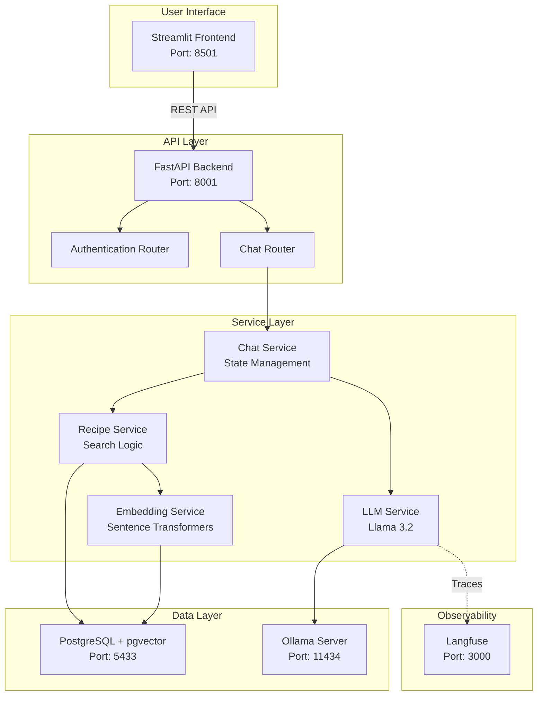

# Recipe Chat System - Master Branch 🍳

## Table of Contents
- [0. Introduction](#0-introduction)
- [1. Documentation](#1-documentation)
- [2. Code and Deployment Structure](#2-code-and-deployment-structure)
- [3. Future Enhancements](#3-future-enhancements)

---

## 0. Introduction

### What This Project Achieves

The Recipe Chat System is an intelligent recipe recommendation platform that bridges the gap between natural language queries and recipe discovery. The system understands conversational requests like "I want a quick Italian vegetarian pasta with tomatoes" and returns relevant recipes from a database of 113,000+ recipes.

### What Has Been Studied and Implemented

#### Core Technologies Mastered:
1. **Large Language Models (LLMs)**: Integration of Llama 3.2 (3B parameters) for natural language understanding
2. **Vector Embeddings & Semantic Search**: Implementation of sentence-transformers (all-MiniLM-L6-v2) for creating recipe embeddings and performing similarity searches
3. **Multi-turn Conversation Management**: Stateful conversation handling with context preservation and intelligent query merging
4. **Structured Output from LLMs**: Forcing LLMs to produce JSON outputs for reliable data extraction
5. **Observability & Monitoring**: Integration of Langfuse for tracking LLM performance, latency, and token usage

#### Key Features Developed:
- **Natural Language Understanding**: Extracts ingredients, dietary preferences, cooking time, and cuisine types from conversational input
- **Intelligent Ingredient Resolution**: Maps user input to canonical ingredient forms (e.g., "tomatos" → "tomatoes" → canonical: "tomato")
- **Multi-dimensional Search**: Combines ingredient matching, tag filtering, and semantic similarity for optimal results
- **Conversation Continuity Detection**: Determines whether new messages are refinements or entirely new queries
- **Production-Ready Deployment**: Two branches with different deployment strategies (local vs. GCP with GPU)

#### Data Engineering Achievements:
- Processing and indexing 113,000+ recipes with complete nutritional information
- Building canonical ingredient mappings for 11,000+ ingredients with variants
- Creating hierarchical tag system for cuisines, diets, and meal types
- Implementing pgvector for efficient similarity search at scale

---

## 1. Documentation

### Local Deployment Guide
**File**: [`Recipes_Ingredients/recipe-chat-system/README.md`](./Recipes_Ingredients/recipe-chat-system/README.md)

This comprehensive guide covers:
- **Quick Start**: Docker-based setup that works out of the box
- **Architecture Overview**: System components and data flow
- **Configuration Options**: Environment variables and customization
- **Langfuse Integration**: Optional LLM observability setup
- **Troubleshooting**: Common issues and solutions
- **Development Setup**: Running services individually for development

**Key Commands**:
```bash
# Basic setup (without observability)
docker-compose up

# With Langfuse observability
docker-compose --profile langfuse up
```

### GCP Production Deployment Guide
**File**: [`Recipes_Ingredients/recipe-chat-system/README.md`](./Recipes_Ingredients/recipe-chat-system/README.md) (GCP branch)

The GCP branch README details:
- **GPU Acceleration**: NVIDIA Tesla T4 integration for 5-10x faster inference
- **Authentication System**: Bearer token-based auth with session management
- **Static IP Configuration**: Production-ready networking setup
- **Management Scripts**: Automated deployment and monitoring tools
- **Cost Optimization**: Start/stop scripts to manage cloud expenses
- **Security Hardening**: Production-grade security configurations

**Deployment Scripts** (GCP Branch):
- [`scripts/deploy-gcp.sh`](./scripts/deploy-gcp.sh): Full production deployment
- [`scripts/manage-instance.sh`](./scripts/manage-instance.sh): Daily management operations
- [`scripts/monitor-performance.sh`](./scripts/monitor-performance.sh): Real-time monitoring
- [`scripts/quick-start-deploy.sh`](./scripts/quick-start-deploy.sh): Quick restart after SSH

---

## 2. Code and Deployment Structure

### Project Architecture

```
recipe-chat-system/
│
├── backend/                      # FastAPI Backend Service
│   ├── main.py                  # Application entry point with health checks
│   ├── config.py                # Environment configuration management
│   ├── models.py                # SQLAlchemy database models
│   ├── database.py              # Database connection management
│   ├── schemas.py               # Pydantic models for validation
│   │
│   ├── routers/                 # API Endpoints
│   │   ├── auth.py             # User authentication & session management
│   │   └── chat.py             # Chat interface & message processing
│   │
│   ├── services/                # Business Logic Layer
│   │   ├── llm_service.py      # Ollama/Llama 3.2 integration
│   │   ├── embedding_service.py # Sentence transformer operations
│   │   ├── recipe_service.py   # Recipe search & retrieval logic
│   │   ├── chat_service.py     # Conversation state management
│   │   └── langfuse_service.py # Observability & tracing
│   │
│   └── prompts/                 # LLM System Prompts
│       └── system_prompts.py   # Structured prompts for extractions
│
├── frontend/                    # Streamlit UI
│   └── app.py                  # Web interface with chat UI
│
├── database/                    # PostgreSQL Setup
│   ├── Dockerfile              # PostgreSQL + pgvector image
│   ├── 00_init_db.sh          # Auto-downloads recipe data (300MB)
│   ├── 01_schema.sql          # Database schema definition
│   ├── 02_indexes.sql         # Standard database indexes
│   └── 07_vector_indexes.sql  # pgvector similarity indexes
│
├── docker-compose.yml          # Service orchestration
├── docker-compose.gpu.yml      # GPU-enabled configuration (GCP)
├── .env.example               # Environment template
└── requirements.txt           # Python dependencies
```

### Data Flow Architecture



### Deployment Configurations

#### Development (Master Branch)
- **Environment**: Local Docker deployment
- **Processing**: CPU-based inference
- **Authentication**: Simplified (hardcoded user for development)
- **Observability**: Optional Langfuse integration
- **Configuration**: Debug mode enabled by default

#### Production (GCP Branch)
- **Environment**: Google Cloud Platform with static IP
- **Processing**: GPU-accelerated (Tesla T4)
- **Authentication**: Full session management with Bearer tokens
- **Observability**: Langfuse enabled with API keys
- **Configuration**: Production-hardened settings

### Key Components Explained

1. **LLM Integration (Ollama + Llama 3.2)**
   - Structured output generation using JSON mode
   - Query extraction, tag identification, continuation detection
   - ~2GB model size, optimized for conversation understanding

2. **Vector Search (pgvector)**
   - 384-dimensional embeddings for all recipes
   - Cosine similarity for semantic matching
   - Indexed for performance at scale

3. **Session Management**
   - In-memory session storage (development)
   - 24-hour TTL with automatic cleanup
   - Conversation state preservation

4. **Database Schema**
   - **recipes**: 113,000+ recipes with full details
   - **ingredients**: Canonical forms with variants
   - **tags**: Hierarchical categorization system
   - **users/conversations/messages**: Chat history

---

## 3. Future Enhancements

### 🥗 Nutrition Calculation and Meal Planning Agent
**Current State**: Basic nutritional data is stored but not fully utilized

**Proposed Enhancements**:
1. **Intelligent Meal Planning**:
   - Weekly meal plan generation based on dietary goals
   - Calorie and macro tracking across meals
   - Grocery list generation from meal plans
   - Budget-aware meal planning

2. **Advanced Nutrition Features**:
   - Real-time nutrition calculation during recipe modification
   - Personalized portion size recommendations
   - Dietary goal tracking (weight loss, muscle gain, etc.)
   - Micronutrient optimization

3. **Recipe Modification Agent**:
   - Suggest healthier ingredient substitutions
   - Adjust recipes for dietary restrictions
   - Scale recipes while maintaining nutritional balance

### ⚡ Query Optimization Techniques

1. **Caching Layer**:
   - Redis integration for frequently searched queries
   - Embedding cache to reduce computation
   - User preference caching for personalization

2. **Database Optimization**:
   - Materialized views for common query patterns
   - Partitioning recipes by popularity/cuisine
   - Advanced indexing strategies for complex queries
   - Query result pre-computation for common searches

3. **Search Algorithm Improvements**:
   - Learning to rank based on user feedback
   - Collaborative filtering for recommendations
   - A/B testing framework for search quality

### 🚀 CI/CD Pipeline Automation

1. **GitHub Actions Workflow**:
   ```yaml
   # Proposed .github/workflows/deploy.yml
   - Automated testing on pull requests
   - Database migration validation
   - Docker image building and registry push
   - Automatic deployment to GCP on merge to main
   - Rollback capabilities
   ```

2. **Infrastructure as Code**:
   - Terraform scripts for GCP resource provisioning
   - Automated SSL certificate management
   - Load balancer configuration
   - Auto-scaling policies

3. **Deployment Pipeline**:
   - Blue-green deployment strategy
   - Automated database backups before deployment
   - Health check validation
   - Performance regression testing

### 🔮 Additional Enhancement Ideas

#### 1. **Enhanced User Experience**
- **Voice Input**: Integration with speech-to-text for voice queries
- **Image Recognition**: Upload food photos to find similar recipes
- **AR Features**: Augmented reality cooking instructions
- **Social Features**: Recipe sharing, ratings, and reviews

#### 2. **Advanced AI Features**
- **Multi-modal Understanding**: Process images alongside text
- **Cooking Skill Assessment**: Adapt recipe complexity to user skill
- **Flavor Profile Learning**: Personalized taste preference modeling
- **Recipe Generation**: Create new recipes based on available ingredients

#### 3. **Performance & Scalability**
- **Kubernetes Deployment**: Container orchestration for scale
- **GraphQL API**: More efficient data fetching
- **Edge Caching**: CDN integration for global performance
- **Microservices Architecture**: Service decomposition for scalability

#### 4. **Data & Analytics**
- **User Analytics Dashboard**: Track popular recipes and trends
- **A/B Testing Framework**: Optimize recommendation algorithms
- **Feedback Loop**: Learn from user interactions
- **Recipe Success Prediction**: ML model to predict recipe ratings

#### 5. **Integration Capabilities**
- **Smart Home Integration**: Connect with smart kitchen appliances
- **Grocery Delivery APIs**: Direct ingredient ordering
- **Calendar Integration**: Meal planning with calendar apps
- **Fitness App Integration**: Sync with MyFitnessPal, Fitbit, etc.

#### 6. **Monetization Features**
- **Premium Subscriptions**: Advanced features for paid users
- **Sponsored Recipes**: Brand partnerships
- **Affiliate Links**: Ingredient and equipment recommendations
- **Recipe Books**: Curated collection exports

### Implementation Priority Matrix

| Enhancement | Impact | Effort | Priority |
|------------|--------|--------|----------|
| CI/CD Pipeline | High | Medium | **High** |
| Nutrition Agent | High | High | **High** |
| Query Optimization | High | Medium | **High** |
| Redis Caching | Medium | Low | **Medium** |
| Voice Input | Medium | Medium | **Medium** |
| Kubernetes | Low | High | **Low** |
| AR Features | Low | High | **Low** |

---

## 📚 Resources and Links

- **GitHub Repository**: [https://github.com/turgutcem/reciperesuggestion](https://github.com/turgutcem/reciperesuggestion)
- **Master Branch**: Local development focus
- **GCP-GPU-Deployment Branch**: Production-ready implementation
- **Data Release**: [v1.0-data](https://github.com/turgutcem/reciperesuggestion/releases/tag/v1.0-data) - Recipe database files

## 🙏 Acknowledgments

This project represents a comprehensive study in modern AI application development, combining:
- State-of-the-art LLM integration
- Production-grade deployment practices
- Scalable data engineering
- User-centric design

The journey from concept to production-ready system demonstrates mastery of full-stack AI development, from data processing through deployment and monitoring.
Special thanks to **Amal Feriani** - my advisor - for helping me throughout the coursework . 

---

*Built with passion for combining AI and culinary arts to help people discover their next favorite meal* 🍽️
